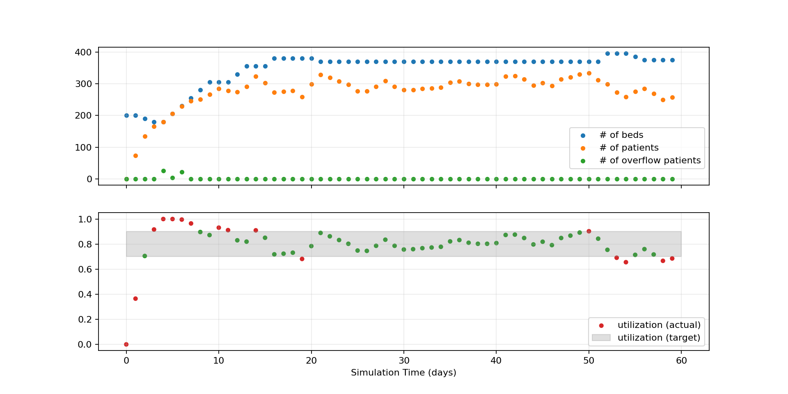

# Optimizing Hospital Bed Utilization with Bonsai and SimPy

This project demonstrates how to integrate [SimPy](https://simpy.readthedocs.io/en/latest/) discrete event simulations with the [Microsoft Bonsai](https://docs.microsoft.com/en-us/bonsai/product/) deep reinforcement learning platform.

In this demo, we train a deep reinforcement learning system to optimize utilization of hospital beds with random patient arrivals.

## Quickstart / Setup Guide

### Installation Requirements

- Access to a Bonsai workspace (see [Microsoft account setup for Bonsai](https://docs.microsoft.com/en-us/bonsai/guides/account-setup)), including [workspace ID](https://docs.microsoft.com/en-us/bonsai/cookbook/get-workspace-info) and [access key](https://docs.microsoft.com/en-us/bonsai/cookbook/get-access-key)

- Python 3.7+

- Python dependencies, including the [Bonsai API](https://github.com/microsoft/microsoft-bonsai-api) (see [requirements.txt](./requirements.txt) for details)

Note: installing the Python dependencies in a virtual environment or Docker container is strongly recommended.

The following dependencies are optional but recommended:

- [Azure CLI](https://docs.microsoft.com/en-us/cli/azure/)
- [Bonsai CLI](https://docs.microsoft.com/en-us/bonsai/cli/)
- [Docker](https://docs.docker.com/desktop/)

### Running the Simulator Locally

1. Clone the project repository to your local machine.
2. Create a new `.env` file in the root of the project folder, and add your workspace credentials.  See [template.env](./template.env) for an example.
3. Build a local Docker container with `docker build -t hospital .`
4. Run the local Docker container with `docker run --env-file .env hospital`

You can now create and train a new brain on the Bonsai platform using the locally running simulator.

### Building the Simulator Image

Unmanaged simulators can only run a single simulation instance for brain training.  To scale up the simulator, we will need to push the Docker container to Azure Container Registry (ACR).  (Creating a Bonsai workspace automatically provisions an associated ACR instance.)

First log into ACR with

```sh
az acr login --name $RegistryName
```

Next, build the image on ACR with the Dockerfile.

```sh
az acr build \
    --image $ImageName \
    --registry $RegistryName \
    --file Dockerfile .
```

Finally, create a new simulator package in the Bonsai workspace.

```sh
bonsai simulator package container create \
    --name $SimulatorName \
    --image-uri "$RegistryName.azurecr.io/$ImageName" \
    --max-instance-count 25 \
    --cores-per-instance 1 \
    --memory-in-gb-per-instance 1 \
    --os-type Linux
```

Here

- `$RegistryName` is the name of your ACR instance,
- `$ImageName` is the name and tag of your container image, e.g. `hospital:v1`, and
- `$SimulatorName` is the name of your simulator in the Bonsai workspace, e.g. `Hospital`.

Note: On PowerShell, replace the backslashes ("\\") with backticks ("`").

### Brain Training

Now that the simulator is connected to the Bonsai platform, we can use it to train a brain.  First, create a new brain in the Bonsai workspace.

Next, upload the [Inkling](https://docs.microsoft.com/en-us/bonsai/inkling/basics) file [hospital.ink](./simpy_demo/hospital.ink) to the Bonsai workspace, and start a brain training session.  It takes around 30 minutes to train both lessons (see "Brain Design", below) to 100% goal satisfaction.

## Brain Design

There are 2 configuration parameters:

- the initial number of patients (0 by default), and
- the initial number of beds (200 by default).

The simulation keeps track of the following states:

- the simulation time (useful for plots and debugging),
- the number of beds in a given day,
- the number of patients in a given day,
- the number of patients turned away because no beds were available, and
- the utilization (the ratio of patients to beds).

The only possible action the brain can take is to change the number of beds.

### Utilization and Queue Theory

Modeling hospital capacity has important applications for policy and resourcing decisions - too few beds, and the hospital may not have capacity to serve an unexpected surge in patient arrivals; too many beds, and the resources are wasted.

One of the fundamental results of [queueing theory](https://en.wikipedia.org/wiki/Queueing_theory) is that the customer (i.e. patient) wait time goes to infinity as the utilization approaches 100% (see, for example, [M/M/c queue](https://en.wikipedia.org/wiki/M/M/c_queue)).

Government regulations and hospital policies have historically set utilization targets at 85%, although more recent research has challenged this assumption.  See Ref. [1](#ref1) for a good overview.

### Lesson Design

For our purposes, it is sufficient to choose a (somewhat arbitrary) target utilization and instruct the brain to keep the utilization within that range.

The first lesson (*StaticStart*) sets the initial number of beds at 200, and the brain learns to keep the utilization between 0.7 and 0.9.  The `within 14` clause requires the brain to reach the target utilization within 14 days for the training episode to be considered successful.

The second lesson (*RandomizeStart*) generalizes to between 200 and 300 beds in increments of 20.

Training episodes run for 2 years.

## Simulation Details

Each day a random number of patients arrive, where the arrival events are governed by a [Poisson distribution](https://en.wikipedia.org/wiki/Poisson_distribution), which is equivalent to modeling the inter-arrival times with an [exponential distribution](https://en.wikipedia.org/wiki/Exponential_distribution).

### Testing the Simulation

Let's use some simple control logic to test the simulation (see [demo_sim.py](./simpy_demo/demo_sim.py)):

- if the utilization is above 0.9, then add 25 beds;
- if the utilization is below 0.7, then remove 10 beds;
- otherwise, keep the beds as they are.

Running the simulation for 60 days with 200 beds and no patients (simulating a newly built hospital or wing) yields the following plot.



It takes around 2 weeks to reach a stable state, with a few days of overflow near the beginning.  After the initial ramp-up, the simple control logic works reasonably well, although it tends to overshoot the utilization targets before the logic kicks in.

## References

<span id="ref1">[1]</span> Green, Linda V. "How Many Hospital Beds?" *INQUIRY: The Journal of Health Care Organization, Provision, and Financing*, (November 2002), 400–412. <https://doi.org/10.5034/inquiryjrnl_39.4.400>.

## Contributing

This project follows [Microsoft's Open Source Code of Conduct](https://opensource.microsoft.com/codeofconduct).

Pull requests and suggestions are welcome.  Prior to submitting a pull request, please auto-format your code with [Black](https://github.com/psf/black) and lint with [Pylint](https://www.pylint.org/).

The [pandas contributing guidelines](https://pandas.pydata.org/pandas-docs/stable/development/contributing.html) are a great resource for preparing and submitting code.

## Acknowledgments

The SimPy simulation in this demo is heavily inspired by Michael Allen's [*learninghospital* project](https://github.com/MichaelAllen1966/learninghospital/blob/master/simpy_envs/env_simple_hospital_bed_1.py).

The Bonsai simulation interface code, especially [main.py](./simpy_demo/main.py) and [interface.json](./simpy_demo/interface.json), is modeled after the `cartpole`, `plastic-extrusion`, and `simple-adder` examples in the [Bonsai API](https://github.com/microsoft/microsoft-bonsai-api).

Many thanks to the following people for helpful comments and suggestions throughout the development of this demo:

- Doc Derwin (Neal Analytics)
- Chris Kahrs (Microsoft)
- Zach Perkel (Neal Analytics)
- Jayson Stemmler (Neal Analytics)
- Edwin Webster (Neal Analytics)
